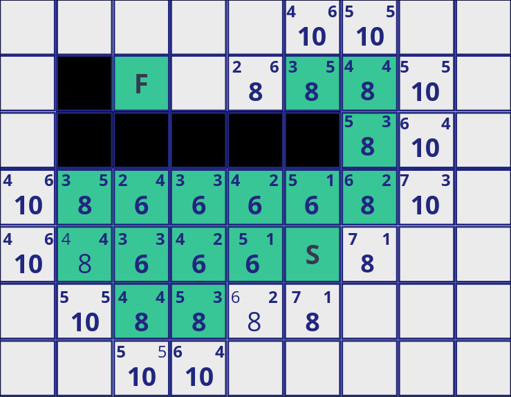

# Shortest path in a maze
### Program usage
```Bash
$ python3 maze_path.py [use A*] <maze_file>
```

using '-a' or '--a_star' you can use A* algorithm

### Description
Mazes represented as 2-dimensional matrixes.
* Value "0" is wall.
* Value "1" is path.
* Value "X" is a starting point.

There are few starting points, that randomly are picked before using
algorithm as starting point and finish point.

By default, uses breadth first search(BFS), optionally can be changed to A*.

### Report
## A* Algorithm
> Mykyta Yagoda

The algorithm is similar to BFS, but gives priorities to each node: how far this node is from the finish_node and how short the path to current vertex is. "How far from the finish_node" is called heuristic(h) and it does not take into account obstacles

$ h = |x_i - x_f| + |y_i - y_f| $

where $x_i, y_i$ -- coordinates of the current node

$x_f, y_f$ -- coordinates of the finish node

When picking next node we choose the one with the best priority among all in queue.
The queue itself stores: priority, coordinates of the node, path from the starting node to it.




#### ``parse()``
Parses the input from the terminal
#### ``read_file()``
Simply reads the file line by line, removing commas
#### ``extract_maze()``
Gets the start points from all "X"
#### ``print_maze()``
Prints the maze to the terminal. Coloring block as it goes.
Red for start and end
Green for path
Light gray for unexplored cells
Dark gray for walls
#### ``random_points()``
Sets random start and end points from all possible
#### ``main()``
Main function. Clears the screen and calls all other functions